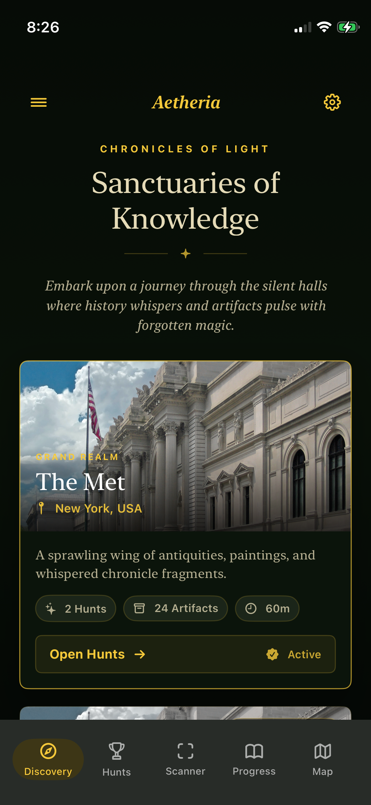
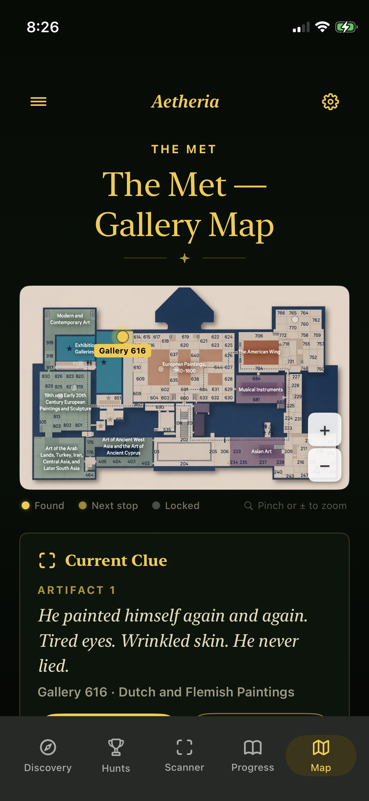
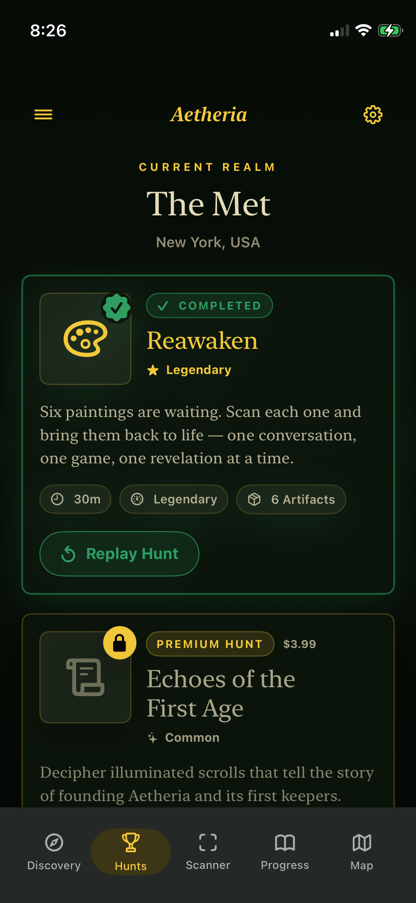
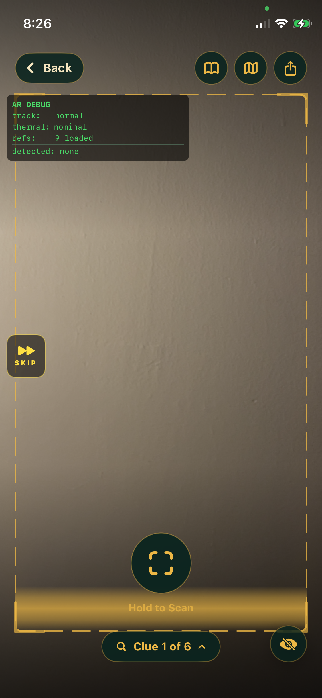
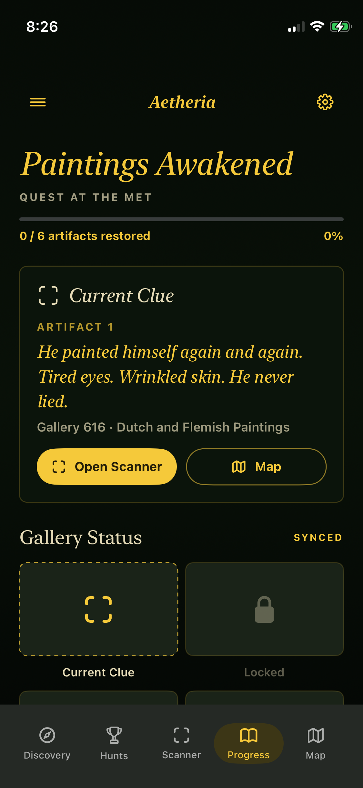

# Aetheria — Museum AR Scavenger Hunt

> **An iOS augmented reality app that brings The Metropolitan Museum of Art to life.**
> Point your phone at a painting. Watch it come alive.

---

## Demo

https://github.com/JansonQuinlanPrieb/aetheria-museum-ar/raw/main/demo.mp4

<sub>▶ Plays inline on GitHub. <a href="https://github.com/JansonQuinlanPrieb/aetheria-museum-ar/raw/main/demo.mp4">Open the clip directly</a> if it doesn't load.</sub>

---

## Screenshots

<p align="center">
  
  
  
  
  
</p>

*Discovery screen · Hunt list · AR scanner · Progress tracker · Gallery map*

---

## What It Does

Aetheria turns six masterworks at the Met into an interactive scavenger hunt. Scan a painting with your iPhone camera — ARKit recognises it in real time, an AR overlay unlocks, and a narrative experience plays directly on the canvas.

| Painting | Artist | Interaction |
|---|---|---|
| Self-Portrait | Rembrandt | Branching dialogue with the painter |
| Hagar in the Wilderness | Corot | Animated video augmentation |
| Marie-Émilie Coignet with a Dog | Unknown | Animated video augmentation |
| **Washington Crossing the Delaware** | Leutze | **Memory card game** (16 tiles across the 6.5m canvas) |
| The Death of Socrates | David | Animated video augmentation |
| Two Men Contemplating the Moon | Friedrich | Animated video augmentation |

Complete all six → see a hunt recap with time, accuracy, and secrets found — shareable directly to Instagram.

---

## Technical Highlights

### AR Image Tracking Pipeline
- **`ARImageTrackingConfiguration`** (not world tracking) — faster re-acquisition, no world-map drift, lower thermal load on LiDAR-less devices (iPhone 12 primary test target).
- One **full-canvas `ARReferenceImage`** per painting, loaded at runtime with the painting's real physical width so ARKit estimates depth correctly.
- **`AnchorEntity(.anchor(identifier:))`** binds RealityKit overlays to the live ARImageAnchor at native 60fps — no manual per-frame transform sync, no world-anchor drift.
- **8–16 on-site reference image variants per painting**, shot under real gallery lighting, auto-cropped to canvas bounds, perspective-corrected to the painting's true aspect ratio via Python + PIL.
- Throttled frame loop (12 fps → 4 fps at thermal `.serious`) with per-frame anchor aggregation to eliminate overlay flickering when multiple variants match simultaneously.

### Key Engineering Problems Solved
- **Overlay drift** — Diagnosed a regression from image-locked to world-anchored placement. The mechanism: a LiDAR-less iPhone at close range with 12fps manual transform sync places the overlay at declared-width depth (~1.8m for a nearby printout), making it float and glide. Fixed with `.anchor(identifier:)` for native-rate image locking.
- **Overlay tilt** — Traced per-painting tilt to keystoned reference photos (camera angle at capture distorts the reference's aspect ratio). Fixed by programmatic perspective-warp of each on-site capture to the painting's true canvas aspect.
- **Detection reliability in a live museum** — Dark/low-contrast paintings fail ARKit's feature-density threshold on web-sourced reproductions. Solved by capturing on-site gallery photos with real lighting, auto-cropping to canvas, and registering as named variants in the detection set.
- **Game texture hitch** — Washington's 16-tile memory game bakes 24 textures synchronously at scan-confirm, dropping frames at reveal. Implemented a pre-warm system that builds entities while the user is still searching, so placement at scan-confirm is instant.
- **Tracking-loss debounce race** — Found a race between `DispatchWorkItem` expiry and `Task` main-actor execution — added an `isTracked` re-check at execution time to prevent false hide on re-acquired anchors.

### Architecture
- **SwiftUI + `UIViewRepresentable`** wrapping `ARView`; `ARSessionDelegate` in a `@MainActor` `Coordinator`.
- **RealityKit** entities parented to `AnchorEntity(.anchor(identifier:))` — perspective-correct overlay at any viewing angle.
- `AVQueuePlayer` + `AVPlayerLooper` for gapless looping video augmentations via `VideoMaterial`.
- `PlayerStatsStore` (singleton, `Codable` → `UserDefaults`) for cross-session hunt stats and easter-egg state.
- Custom **Supabase REST client** (no SDK) for auth, leaderboard records, and hunt completions.
- **RevenueCat** for premium hunt in-app purchases.
- `ReplayKit` for 15-second AR clip capture and sharing.

### Auth
Sign in with Apple (primary), Google OAuth via `ASWebAuthenticationSession`, and passwordless email (Supabase OTP 6-digit code). No third-party auth SDKs.

---

## Stack

| Layer | Technology |
|---|---|
| Language | Swift 5.9 |
| UI | SwiftUI |
| AR | ARKit 6 + RealityKit 2 |
| Video | AVFoundation |
| Auth | Sign in with Apple · Google OAuth · Supabase Auth (OTP) |
| Backend | Supabase (PostgreSQL + Edge Functions) |
| Payments | RevenueCat |
| Target | iOS 17+ · iPhone · tested on iPhone 12 (no LiDAR) |

---

## Project Structure

```
MuseumARScanner/
├── AR/
│   ├── ARPaintingScannerView.swift      # AR session, image tracking, overlay placement
│   └── MemoryGameController.swift       # 16-tile memory game on the Washington canvas
├── Models/
│   └── Painting.swift                   # Catalog: 6 Met paintings, physical sizes, refs
├── ViewModels/
│   └── ScanViewModel.swift              # Hunt state machine, scan flow, game progression
├── Views/
│   ├── ScannerChromeView.swift          # AR HUD, scan button, clue pills, chrome
│   ├── HuntCompletionView.swift         # End screen + Instagram-shareable score card
│   └── AetheriaLoginView.swift          # Auth: Apple / Google / Email
├── Services/
│   └── SupabaseService.swift            # REST auth + data layer (no SDK)
└── Assets.xcassets/                     # Reference images: primary + on-site variants
```

---

> *Source code is private. Available for review upon request.*

---

*Built for The Metropolitan Museum of Art, New York.*
